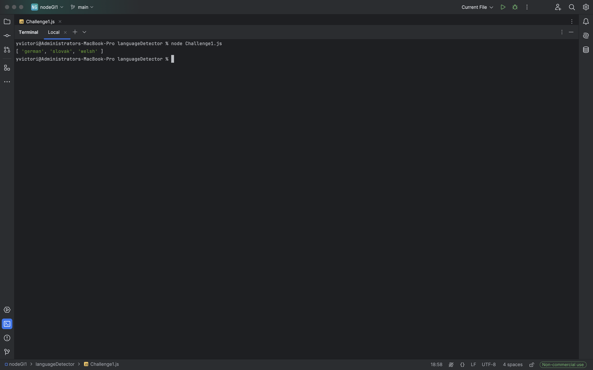

Node.JS Guided Inquiry
============
[](https://github.com/IgorAntun/node-chat/stargazers) [](https://github.com/IgorAntun/node-chat/issues) [](https://github.com/IgorAntun/node-chat) [](https://igorantun.com/chat) [](https://gitter.im/IgorAntun/node-chat?utm_source=badge&utm_medium=badge&utm_campaign=pr-badge)

This is a Node.js application in which users can access current weather data based on their location and manage personal notes through a command-line interface. The application is designed with a user-friendly Material Design interface, making it easy to navigate and use.

###

### Uses the npm package languageDetector to find multiple strings language




---

## Features
- Weather information retrieval based on user location
- Note management system (add, remove, edit, list, read notes)
- Other awesome features yet to be implemented


---

## Setup
Clone this repo to your desktop and run `npm install` to install all the dependencies.

You might want to look into `config.json` to change the port you want to use and set up an SSL certificate.

---

## Usage
After you clone this repo to your desktop, go to the root directory of either hostedWeatherApp, languageDetector, or notesApp respectively and run `npm install` to install their dependencies.

Once the dependencies are installed, you can run `npm start` to start the application. You will then be able to access it at `localhost:8080`.


### Weather Feature
The application allows users to fetch weather information based on their location. Users can input their location and select units (Celsius, Fahrenheit, or Kelvin) to get the current weather conditions.

### Note Management Feature
The application includes a note management system that allows users to:
- Add notes with a title and body
- Remove notes by title
- Edit existing notes
- List all notes
- Read a specific note by title

The note management functionality is implemented using Yargs for command-line argument parsing.

---

## License
>You can check out the full license [here]()

This project is licensed under the terms of the **MIT** license.

---

## Codebase Overview

### Client-Side Code
The client-side code handles user interactions and fetches weather data based on user input. Here is a brief overview of the key components:

```javascript
const weatherForm = document.querySelector('form');
const search = document.querySelector('input');
const messageOne = document.querySelector('#message-1');
const messageTwo = document.querySelector('#message-2');
const checkboxes = document.querySelectorAll('input[type="checkbox"]');

const getLocationWeather = async (userLocation, userUnits = 'c') => {
    try {
        messageOne.textContent = 'Loading...';
        messageTwo.textContent = '';
        const response = await fetch(`/weather?address=${userLocation}&units=${userUnits}`);
        const dataJson =